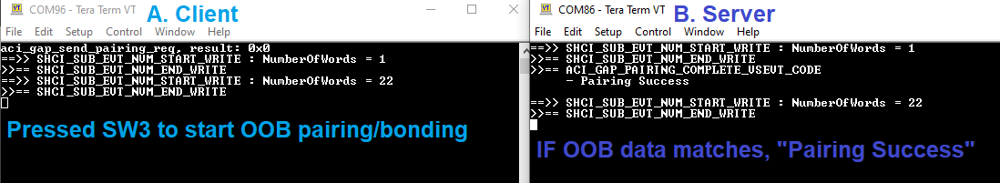

# STM32WB55-p2p-Server-OOB-UART

* The STM32WB55-p2p-Server-OOB-UART is a BLE OOB pairing/bonding example, which is similar to [STSW-ST25DV004](https://www.st.com/content/st_com/en/products/embedded-software/st25-nfc-rfid-software/stsw-st25dv004.html) BLE + NFC OOB pairing demo [shown here](https://youtu.be/O6livACHRKg).
* This demonstrates the exchange of OOB data between two STM32WB55s using UART.
* An additional STM32WB55 central simulates the generation of OOB data that will be sent to the peripheral.
* For more information check
    *  [PM0271](https://www.st.com/resource/en/programming_manual/pm0271-stm32wb-ble-stack-programming-guidelines-stmicroelectronics.pdf) STM32WB BLE stack programming guidelines
    *  [AN5289](https://www.st.com/resource/en/application_note/dm00598033-building-wireless-applications-with-stm32wb-series-microcontrollers-stmicroelectronics.pdf) Building wireless applications with STM32WB Series microcontrollers
    *  [AN5270](https://www.st.com/resource/en/application_note/an5270-stm32wb-bluetooth-low-energy-wireless-interface-stmicroelectronics.pdf) STM32WB Bluetooth Low Energy wireless interface
    *  [ST Devcon 2019 - Secure Bluetooth Pairing Using NFC](https://www.st.com/content/dam/AME/2019/developers-conference-2019/presentations/STDevCon19_2.5_SecurePairingNFC.pdf)

## Hardware Needed

  * Two [P-NUCLEO-WB55](https://www.st.com/en/evaluation-tools/p-nucleo-wb55.html) boards
    *  One STM32WB55 central board running [STM32WB55-p2p-Client-OOB-UART](https://github.com/stm32-hotspot/STM32WB55-p2p-Client-OOB-UART)
    *  One STM32WB55 peripheral board running STM32WB55-p2p-Server-OOB-UART

## Software Needed

  * Build the project using IAR EWARM v9+ / Keil MDK ARM v5+ / STM32CubeIDE v1.9.0+

## User's Guide

1) [Flash the BLE wireless stack](https://youtu.be/1LvfBC_P6eg) on the P-NUCLEO-WB55 boards. When selecting the wireless stack, check the [Release Notes for STM32WB Copro Wireless Binaries](https://github.com/STMicroelectronics/STM32CubeWB/tree/master/Projects/STM32WB_Copro_Wireless_Binaries/STM32WB5x) whether the selected stack supports LE secure connections.

2) Build both STM32WB55-p2p-Client-OOB-UART and STM32WB55-p2p-Server-OOB-UART to flash the application firmware on to each P-NUCLEO-WB55 board.

3) Unpower both P-NUCLEO-WB55 boards and connect the boards using jumpers.

    A) Client board: PC1 (CN7.30 / LPUART1 TX)

    B) Server board: PB7 (JP5 RX / USART1 RX)

    Connect the UART pins and GND.
    

4) Power both P-NUCLEO-WB55 boards. If needed, terminal programs like Tera Term can be used to see the logs of each boards via the onboard ST-Link. (115200/8/1/n)

5) From the client side, press SW1 to send the OOB data via UART (PC1 to PB7). After sending the OOB data, the client scans and connects to the server.

6) Then press SW3 from the client side to start the OOB pairing/bonding.

If the OOB data matches, OOB pairing/bonding will be successful. You can use a sniffer to check the OOB pairing request and response.

7) If the Server received an incorrect OOB data for some reason,

OOB pairing/bonding will fail. To simulate this, modify [app_ble.c](STM32_WPAN/App/app_ble.c) APP_BLE_set_oob() function to sabotage the OOB data.

## Troubleshooting

**Caution** : Issues and the pull-requests are **not supported** to submit problems or suggestions related to the software delivered in this repository. The STM32WB55-p2p-Server-OOB-UART example is being delivered as-is, and not necessarily supported by ST.

**For any other question** related to the product, the hardware performance or characteristics, the tools, the environment, you can submit it to the **ST Community** on the STM32 MCUs related [page](https://community.st.com/s/topic/0TO0X000000BSqSWAW/stm32-mcus).